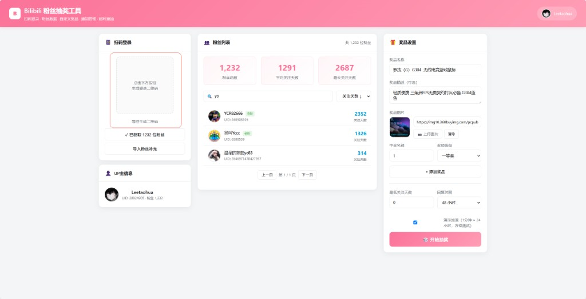

# Bilibili 粉丝抽奖工具

一款面向 B 站 UP 主的粉丝抽奖 Web 工具，支持扫码登录、粉丝数据拉取、自定义奖品、公平抽奖、中奖私信通知与超时重抽。

**作者：** [Leetaohua](https://space.bilibili.com/28924905)

🌐 **[在线宣传页](https://c01djc.github.io/BilibiliLottery/)** · 本地预览：打开 `docs/index.html`

## 预览



## 功能特性

- **扫码登录** — 使用 B 站 App 扫码，安全获取登录态
- **粉丝数据** — 自动拉取粉丝列表（头像、昵称、UID、关注天数）
- **评论抽奖（大 UP 推荐）** — 从抽奖视频评论者中抽取参与者，突破粉丝 API 2000 限制
- **粉丝拉取** — 自动获取粉丝列表；API 限制下最多约 2000 人，超出可 CSV 导入
- **自定义奖品** — 支持奖品名称、描述、图片（链接或本地上传）
- **公平抽奖** — 服务端 CSPRNG 均等概率抽签，不展示算法细节
- **抽奖仪式感** — 全屏舞台、老虎机动画、倒计时、逐奖揭晓
- **中奖通知** — 私信发送、回复检测、自定义时限、超时自动重抽
- **后台运行** — Windows 双击启动，关闭窗口不影响服务

## 环境要求

- [Node.js](https://nodejs.org) 18 或更高版本
- Windows（推荐双击 `启动.bat` 使用）

## 快速开始

### Windows（推荐）

1. 克隆仓库并进入目录
2. 双击 **`启动.bat`**
3. 浏览器自动打开 http://localhost:3000
4. 停止服务请双击 **`停止.bat`**

### 命令行

```bash
git clone https://github.com/c01djc/BilibiliLottery.git
cd BilibiliLottery
npm install
npm start
```

访问 http://localhost:3000

## 使用流程

1. 点击「生成二维码」，使用 B 站 App 扫码登录
2. 选择参与池：
   - **小 UP**：点击「获取粉丝数据」
   - **大 UP**：在抽奖视频下让用户评论，填入 BV 号后点击「从视频评论获取参与者」
   - **完整名单**：使用「导入粉丝补充」上传 CSV/JSON
3. 在右侧设置奖品（名称、图片、名额、等级）
4. 点击「开始抽奖」，按流程揭晓中奖者
5. 在通知管理面板发送私信，等待回复或触发超时重抽

### 粉丝补充导入

若自动拉取仍有缺失，可使用「导入粉丝补充」，支持 JSON 或 CSV：

```csv
uid,昵称,关注天数
12345678,粉丝昵称,365
```

## 配置

可选环境变量（生产环境建议设置）：

| 变量 | 说明 | 默认值 |
|------|------|--------|
| `PORT` | 服务端口 | `3000` |
| `SESSION_SECRET` | Session 签名密钥 | 内置默认值（请修改） |

复制 `.env.example` 为 `.env` 后按需修改（需自行加载，或直接在启动前设置环境变量）。

## 项目结构

```
BilibiliLottery/
├── 启动.bat              # Windows 后台启动
├── 停止.bat              # 停止服务
├── start-server.vbs      # 后台进程脚本
├── public/
│   └── index.html        # 前端页面
└── server/
    ├── app.js            # Express 入口
    ├── routes/           # API 路由
    └── services/         # B 站 API、抽奖引擎
```

## 免责声明

- 本项目仅供学习与交流，请遵守 [B 站用户协议](https://www.bilibili.com/protocal/licence.html) 及相关法律法规
- 请合理控制 API 请求频率，勿用于商业用途或滥用接口
- 抽奖结果由服务端随机生成，作者不对任何活动纠纷承担责任
- B 站接口可能变更，导致部分功能失效

## 开源协议

本项目采用 [MIT License](LICENSE) 开源。

## 致谢

- [bilibili-API-collect](https://github.com/SocialSisterYi/bilibili-API-collect) — B 站 API 参考
